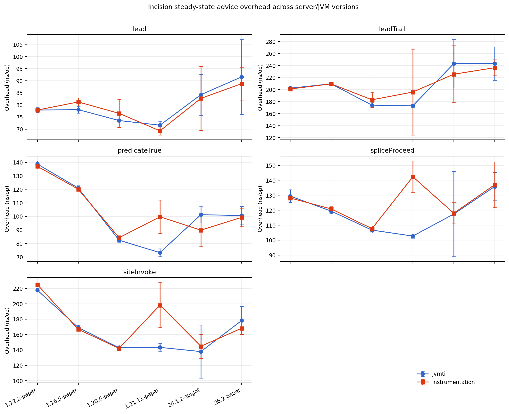
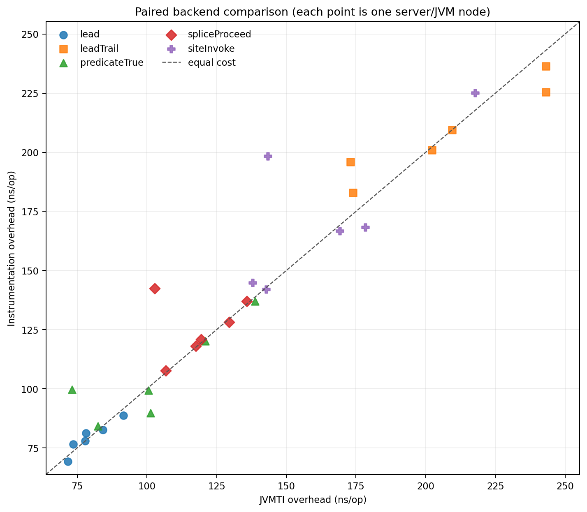
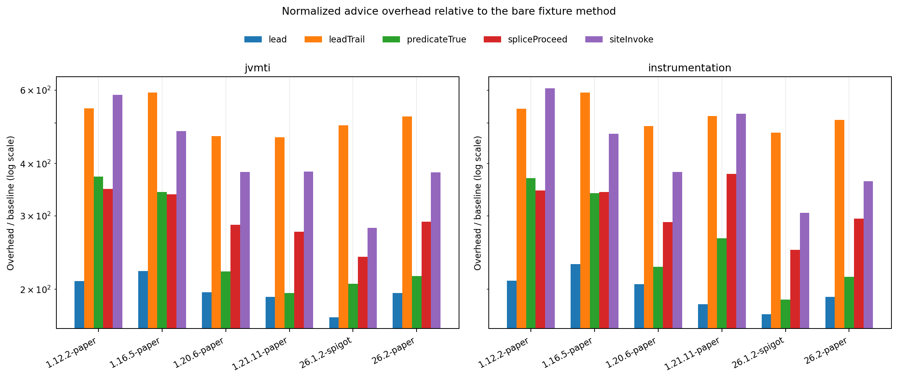
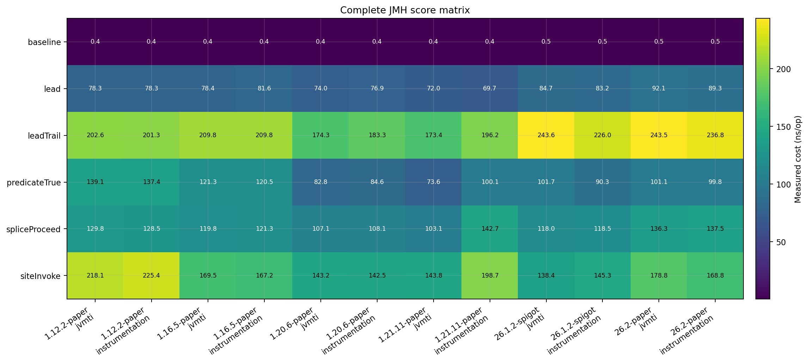

# Incision JMH 多版本、多 Backend 性能报告

测试日期：2026-07-28

## 结论

本轮在 6 个 Minecraft 服务端节点、4 个 Java 主版本和 2 个 Incision Backend 上完成了
12 次独立服务端进程测试。每个节点包含 6 项 JMH 1.37 基准，共得到 72 条有效结果，单位均为
`ns/op`。所有节点都实际完成 advice 织入，未发现 Backend 虚报、JMH 失败或服务端字节码污染信号。

- 单个空 `Lead` 的实测总成本为 `69.709～92.075 ns/op`。
- `Lead + Trail` 为 `173.362～243.602 ns/op`，是本轮成本最高的入口组合。
- 真值 `predicate` 为 `73.574～139.100 ns/op`；表达式求值成本会随 JVM/JIT 状态变化。
- `Splice + proceed` 为 `103.135～142.728 ns/op`。
- `Site INVOKE` 为 `138.381～225.408 ns/op`。
- 五种 advice 的跨节点平均额外成本为：JVMTI `134.673 ns/op`，Instrumentation
  `138.582 ns/op`，相差 `3.909 ns/op`（约 `2.9%`）。该差值小于单节点噪声和离群点影响，
  不足以说明某个 Backend 在稳态调用阶段更快。

Backend 决定类定位、转换和重转换的安装路径；安装完成后，两者执行的是同一份 Incision
dispatcher/advice 字节码。因此 Backend 应优先按当前 JVM 的能力与稳定性选择，不能根据本轮
`forks=0` 的小幅稳态差值选择。一次性扫描、weave、verify 和 retransform 成本不在本报告内。

## 完整结果

以下是 JMH `primaryMetric.score`，未减去基线。误差和原始 7 轮样本保存在 CSV 与 JSON 中。

| 服务端 | Java | Backend | baseline | Lead | Lead+Trail | predicate | Splice | Site INVOKE |
| --- | ---: | --- | ---: | ---: | ---: | ---: | ---: | ---: |
| Paper 1.12.2 build 1620 | 8 | JVMTI | 0.372 | 78.280 | 202.617 | 139.100 | 129.819 | 218.148 |
| Paper 1.12.2 build 1620 | 8 | Instrumentation | 0.371 | 78.279 | 201.298 | 137.415 | 128.547 | 225.408 |
| Paper 1.16.5 build 794 | 16 | JVMTI | 0.353 | 78.441 | 209.849 | 121.317 | 119.787 | 169.522 |
| Paper 1.16.5 build 794 | 16 | Instrumentation | 0.353 | 81.604 | 209.800 | 120.483 | 121.263 | 167.157 |
| Paper 1.20.6 build 151 | 21 | JVMTI | 0.374 | 73.958 | 174.350 | 82.771 | 107.124 | 143.209 |
| Paper 1.20.6 build 151 | 21 | Instrumentation | 0.372 | 76.927 | 183.281 | 84.608 | 108.106 | 142.494 |
| Paper 1.21.11 build 132 | 21 | JVMTI | 0.374 | 72.042 | 173.362 | 73.574 | 103.135 | 143.758 |
| Paper 1.21.11 build 132 | 21 | Instrumentation | 0.376 | 69.709 | 196.231 | 100.092 | 142.728 | 198.734 |
| Spigot 26.1.2 build 4620 | 25 | JVMTI | 0.492 | 84.728 | 243.602 | 101.749 | 117.964 | 138.381 |
| Spigot 26.1.2 build 4620 | 25 | Instrumentation | 0.475 | 83.190 | 225.972 | 90.308 | 118.509 | 145.269 |
| Paper 26.2 build 84 | 25 | JVMTI | 0.468 | 92.075 | 243.501 | 101.101 | 136.295 | 178.812 |
| Paper 26.2 build 84 | 25 | Instrumentation | 0.464 | 89.268 | 236.805 | 99.794 | 137.478 | 168.770 |

绝对纳秒开销是本报告的主要判断指标。现代 Paper 1.20.6/1.21.11 在 JVMTI 下的 Lead、
predicate、Splice 和 Site 成本相对较低；Java 25 并没有让所有场景单调变快，说明 dispatcher
形态、服务端后台负载和本轮 JIT 状态比 Java 主版本本身更能解释差异。

虚线表示两个 Backend 成本相同。多数点靠近虚线；Paper 1.21.11 Instrumentation 的
`Lead+Trail`、`predicate`、`Splice` 和 `Site` 偏离较大，但其 `Lead+Trail` 误差达到
`71.564 ns/op`，其余场景误差也明显高于同节点 JVMTI。这是高方差样本，不应解释为
Instrumentation 固有的 dispatcher 成本。

归一化图使用 `(advice - baseline) / baseline` 并采用对数纵轴。裸方法会被 JIT 内联和常量折叠，
基线仅为 `0.353～0.492 ns/op`，因此倍数会被放大到数百倍。该图只用于观察不同节点的相对形态，
不能用于估算真实业务方法的百分比损耗；真实方法越重，Incision 固定纳秒开销占比通常越低。

## 测试矩阵

| 节点 | 服务端构建 | JVM |
| --- | --- | --- |
| 1.12.2 | Paper 1620 | Zulu OpenJDK `1.8.0_472` |
| 1.16.5 | Paper 794 | Zulu OpenJDK `16.0.2+7` |
| 1.20.6 | Paper 151 (`a4f0f5c`) | Zulu OpenJDK `21.0.10+7-LTS` |
| 1.21.11 | Paper 132 (`c5eb079`) | Zulu OpenJDK `21.0.10+7-LTS` |
| 26.1.2 | Spigot 4620 (`566f972-3347052`) | Zulu OpenJDK `25.0.2+10-LTS` |
| 26.2 | Paper 84 (`26e81c4`) | Zulu OpenJDK `25.0.2+10-LTS` |

硬件为 AMD Ryzen 9 9950X3D（16 核 / 32 线程），系统为 Windows 11。每个服务端使用
`-Xms512M -Xmx1536M`，Java 21/25 额外启用 `-XX:+EnableDynamicAgentLoading`，所有 JVM
均设置 `-Djdk.attach.allowAttachSelf=true`。

## JMH 方法

- JMH 版本：`1.37`。
- 模式：`AverageTime`，时间单位 `NANOSECONDS`，单线程。
- 预热：3 轮，每轮 500 ms。
- 测量：7 轮，每轮 500 ms。
- JMH fork：`0`。
- 进程隔离：每个服务端/Backend 节点由矩阵脚本启动全新的 Minecraft JVM，测完即停止。
- 织入确认：计时前调用独立 `probe`，只在 advice 恰好命中一次时运行 JMH。
- 功能回归隔离：性能进程设置 `-Dincision.test.autoRun=false`，避免完整用例、reload 和重复
  retransform 污染 JIT 与 Backend 状态。

这里固定 `forks=0` 是运行边界，不是为了缩短测试：JMH 子 JVM 不包含 Bukkit、插件
ClassLoader、已安装 Backend 和已织入的目标类，普通 fork 会测到错误环境。矩阵用 12 次独立
Minecraft 进程恢复了节点级隔离，但每个节点只有一个 JMH 进程样本，因此不能把本报告当作多 fork
置信性研究。

## 场景定义

| 基准 | 被测路径 |
| --- | --- |
| `baseline` | 未织入的 `value + 1` |
| `lead` | 一个无状态空 Lead |
| `leadTrail` | 一个空 Lead 加一个空 Trail |
| `predicateTrue` | Lead 加已编译的 `args[0] >= 0` 真值 predicate |
| `spliceProceed` | Splice 调用 `theatre.resume.proceed()` |
| `siteInvoke` | 在内部 helper INVOKE 调用点执行一个空 Graft |

所有方法都返回计算结果，由 JMH 消费返回值。Advice 不进行日志、计数或外部 I/O。报告衡量的是
已完成织入后的稳态调用成本，不包含扫描注解、坐标 remap、ASM weave、字节码 verify、native attach、
类重转换或回滚成本。

## 完整性与安全检查

- 12 个 JSON 文件均包含 6 条结果，且全部为 `ns/op`。
- 12 个日志均存在对应的 `JMH-START`、6 条 `JMH-RESULT` 和 `JMH-END`。
- 每个日志的 `installWeaver` 均确认实际使用脚本指定的 `JVMTI` 或 `Instrumentation`。
- 日志扫描未发现 `JMH-FAILED`、`NoClassDefFoundError`、`VerifyError`、`zip file closed`、
  `Bridge dispatch failure`、native error 64/67 或 `retransform=false/failed`。
- 两种 Backend 在 Java 8、16、21、25 上均可用，本轮没有 `UNAVAILABLE` 节点。

## 数据与复现

- 原始 JMH JSON：`performance/jmh-2026-07-28/raw/`
- 完整服务端日志：`performance/jmh-2026-07-28/console/`
- 逐项 CSV：`performance/jmh-2026-07-28/data/jmh-summary.csv`
- 聚合 CSV：`performance/jmh-2026-07-28/data/jmh-aggregate.csv`
- 图表：`performance/jmh-2026-07-28/charts/`
- JMH 矩阵脚本：`performance/scripts/run-jmh-matrix.ps1`
- Python 图表脚本：`performance/scripts/generate-jmh-report.py`

脚本同时保留在 Incision-Test 的 `scripts/` 中，便于测试插件自身维护；TabooLib 模块内副本是报告
对应的归档版本。模块内矩阵脚本通过 `-IncisionTestRoot` 指定测试项目，通过 `-ServerRoot` 指定
服务端矩阵根目录，默认值与本次实测环境一致。

旧的 `PERFORMANCE-REPORT-2026-07-28.md` 是 Paper 1.21.11/JVMTI 上使用 `System.nanoTime()`
批量计时的历史结果，用于与早期实现对照；本报告是正式的多版本、多 Backend JMH 矩阵结果。
